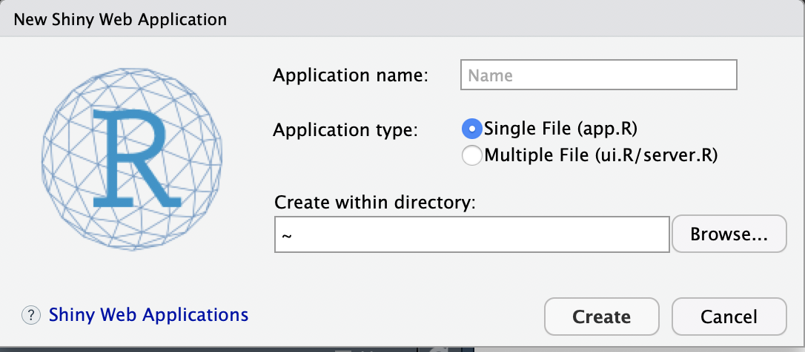
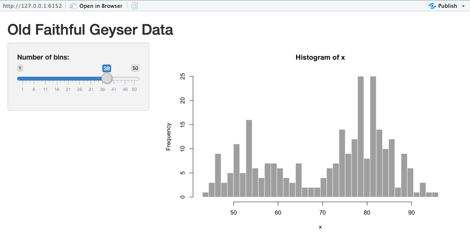
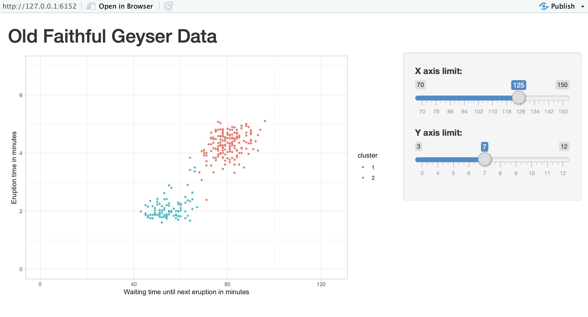

```{r setup, include=FALSE}
knitr::opts_chunk$set(echo = TRUE)
knitr::opts_chunk$set(eval = FALSE)
knitr::opts_chunk$set(fig.width = 2)
```

## Starting with Shiny

### Introduction
In the previous unit, we have talked a bit about the advantages of creating web applications with R. Now, over the next few units we will cover how we can actually build such web applications. 

Web applications in R can be easily built using the <a href="https://shiny.rstudio.com/">\(\{shiny\}\)</a> package. This first unit, **starting with shiny**, aims to give you a conceptual understanding of how shiny apps work. By the end of it, you should be able to create a very basic shiny app yourself.

### Shiny
The core aim of \(\{shiny\}\) is to create web applications with R, that allow an end-user to interact with the data presentation and analysis. A good way of thinking about it is that it allows the end user to do things with R, without needing to know R. To get an idea of what is possible, have a look at R Studio's <a href="https://shiny.rstudio.com/gallery/">Shiny Gallery</a>

Because we are dealing with a web application, inevitably this draws on more tools than just R. In fact, what we are building when making a Shiny web app is an HTML page, using among other things javascript to make it all work. The good news is though, that R does this all under the bonnet. You, as the developer, are only required to write some R code consisting of functions from the \(\{shiny\}\) package for the presentation of the app, and some R code from other (by now familiar) packages with which you manipulate the data. When you compile your app, \(\{shiny\}\) will take care of the rest.

#### Extra info {.codeexplained} 
On the other hand, for those who are experienced in building webpages: because it is a webpage, it comes with all the advantages and flexibility of that too. If you want to customise the style of the app you can write a custom css. You can add javascript elements and even pass data, after being processed by R, onto d3.js to create beautiful dynamic visualisations. We won’t cover these advanced customizations in this unit, but it is useful to know that \(\{shiny\}\) is a very powerful tool in which you can make full use of R’s capacities and combine it with the advantages of other software to develop very power data analysis and communication tools. 

### How does Shiny work? 

##### Setting up an app
To learn how \(\{shiny\}\) works, let's start with creating a very basic \(\{shiny\}\) app, using R Studio's basic template. 

First, start **R Studio**, go to **file**, choose **New File**, and select **Shiny Web App...**. You will see the following prompt: 

```{r img1, eval=TRUE, echo=FALSE, fig.align="center", out.width="50%"}

```

Now do the following: 

- Application name: Give the application an intuitive name, e.g.: *intro_shiny*
- Application type: For educational purposes please select *Multiple File (ui.R / server.R)*. Both options work, but this option helps to conceptually understand how \(\{shiny\}\) works. 
- Create within directory: Choose a path within which you want to store your \(\{shiny\}\) project.
- Now click *Create*

R Studio will now generate two R files **ui.R** and **server.R**. If you look on top of the source code pane, you will see a button *Run app*. This button launches the \(\{shiny\}\) app that is generated by these two R files. Now, run the app and have a play around with it to see what it does.

The app looks like this: 

```{r img2, eval=TRUE, echo=FALSE, fig.align="center", out.width="80%"}

```

Right now, it looks as if the app is just R Studio output, but it's actually a webpage, that the R Studio viewer is showing us. If you want to view it in your browser, just click *Open in Browser* on the top of the window.

#### Open Answer Exercise {.codeexplained}
The code for each file that makes up the app is included below. Have a look at each file. Can you formulate in your own words what the primary purpose of each of the two files is? 

To help you do this, have a look at the comments in the code, at the functions and what they do. Also think about how this code relates to the app itself. Consider what the primary differences are between the functions in the two files. 

*ui.R*
```{r ui_code}
library(shiny)

# Define UI for application that draws a histogram
shinyUI(fluidPage(
  
  # Application title
  titlePanel("Old Faithful Geyser Data"),
  
  # Sidebar with a slider input for number of bins 
  sidebarLayout(
    sidebarPanel(
       sliderInput("bins",
                   "Number of bins:",
                   min = 1,
                   max = 50,
                   value = 30)
    ),
    
    # Show a plot of the generated distribution
    mainPanel(
       plotOutput("distPlot")
    )
  )
))
```

*server.R*
```{r server_code}
library(shiny)

# Define server logic required to draw a histogram
shinyServer(function(input, output) {
   
  output$distPlot <- renderPlot({
    
    # generate bins based on input$bins from ui.R
    x    <- faithful[, 2] 
    bins <- seq(min(x), max(x), length.out = input$bins + 1)
    
    # draw the histogram with the specified number of bins
    hist(x, breaks = bins, col = 'darkgray', border = 'white')
    
  })
  
})
```

#### The workflow of a shiny app: The user interface and the R process

As you may have concluded from the exercise above, a \(\{shiny\}\) app consists of two components: A user interface, and an R process. Let's start with the user interface.

The user interface is defined by the ui.R file. This generates the website. It is the part of the app that the end user sees and interacts with. In our current app the UI is the script that gives the app a title, it creates a slider that registers a (numerical) input between 1 and 50, and puts a graph on the page.

In addition to the user interface, there is an R process running in the background, which is defined in the server.R file. You can think of this as the engine running the website. This process takes some data and performs some operations on it using familiar R commands (e.g. analysis, visualization). These operations are not fixed however. The R process is constantly listening for user input, and can alter its operations on the data on the basis of this user input. The result of these operations can then be presented on the website. In our current app the server file loads some data on which it creates a histogram. The number of bins it uses for this histogram is based on numerical input that the server has received from the user interface. The server then passes this histogram with the appropriate number of bins to the user interface as the graph that needs to be displayed.

In a nutshell, we can summarise the workflow of a shiny app as follows:

1. The UI registers input from the user and passes this onto the server.
2. The server then uses R functionality to perform the a set of R commands on the data, which incorporate this user input, and passes the result back to the UI.
3. The UI then displays this output to the user.
4. The user can then provide new input and the whole process repeats.

#### Multiple Choice Exercises {.codeexplained}
In which of the two files do I need to work if I want to change the following things *as a developer* (keeping all else equal):

**I want to change the dataset used for drawing the histogram**

- (ui.R)  
- (server.R)

**I want to increase the maximum number of bins that a user can select**

- (ui.R)  
- (server.R)

**I want to swap the slider for number of bins and the histogram around**

- (ui.R)  
- (server.R)

**I want to change the colour of the bins**

- (ui.R)  
- (server.R)

### A first app

#### Project Exercise {.codeexplained}

Have a look at the example app below. This app is designed to illustrate to the user the relationship between two variables. Further, the user is given the opportunity to play around with the scaling of the axes to communicate the importance of proper scaling of axes in data visualization.

```{r img3, eval=TRUE, echo=FALSE, fig.align="center", out.width="80%"}

```

The aim of this exercise is for you to reproduce a part of this app. It does not have to be exactly the same. The minimum features the app needs to contain are:

- a scatter plot with appropriately labeled axes
- a slider with which you can change the maximum value of the x axis.

If you want to expand on the features the app offers you are of course also more than welcome to do so.

Below are provided some pointers on how to approach this exercise. You can use any or all of these pointers, or decide to completely take your own approach, as long as the end result satisfies the above criteria. 

1. You will see that this app is not so different from the template app that R Studio provides. A useful approach could be to take the template, and think about what you need to change to the template to get to the current app.
2. The dataset for this exercise is the same as for the R Studio template app, i.e. 'faithful'. However, instead of one we use two variables from this dataset here. Use your knowledge of R to work out how to access both variables. A description on the dataset can be found <a href="https://stat.ethz.ch/R-manual/R-devel/library/datasets/html/faithful.html">here</a>, which is useful information to have when you are deciding how to label the axes.
3. You can use additional packages when building a \(\{shiny\}\) app. Although you should be able to achieve a scatterplot using the preloaded packages from R, feel free to draw on the previous units and load \(\{ggplot2\}\) if you prefer. The example above was drawn using \(\{ggplot2\}\).
4. The colours in the graph are optional, but they serve a useful purpose in highlighting that there are two clusters in the data. If you would like to implement the colours yourself, you need a statistical approach to cluster the data first (i.e. assign datapoints to groups based on their similarity with other datapoints in the dataset). For the example above the k-means algorithm was used. Have a look <a href="https://www.r-bloggers.com/k-means-clustering-in-r/">here for a blog post</a> explaining how to achieve this in R. When you have obtained the clusters, use your existing knowledge of R (in particular \(\{ggplot2\}\)) to colour the datapoints. 

### Conclusion

In conclusion, hopefully this unit will have helped you to understand how a basic \(\{shiny\}\) app works. 

We know that there are two parts to a \(\{shiny\}\) app, and we can manipulate things both on the user interface as well as the R processing side to create an app that does what we want it to do.

This should set you up for the next set of units. But, if you are unsure of any of the topics discussed here, feel free to reach out. We are happy to help.


